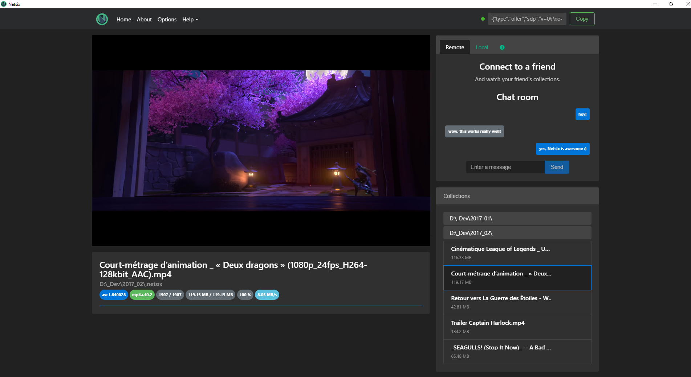

# Netsix

> Netsix allows you to share videos with your friends in a real peer-to-peer manner using WebRTC.

[](https://mmorainville.github.io/netsix-gh-pages/)

## Table of Contents

- [Getting Started](#getting-started)
- [Disclaimer](#disclaimer)
- [Roadmap](#roadmap)
- [Build Setup](#build-setup)
- [Git Commit Guidelines](#git-commit-guidelines)
- [Something Missing?](#something-missing)

## Getting Started

You have to be two to test this application. So find a friend with some cool videos on his computer and then follow the steps described in the `Getting started` section of the [Netsix website][netsix-gh-pages].

Be aware that a current limitation of the Netsix alpha is that we only handle 1-1 connections. If someone wants to connect to you, he will encounter an error if you are already connected to someone else.
We plan to implement the support for simultaneous connections later as this is technically possible as described in the [simple-peer documentation](https://github.com/feross/simple-peer#connecting-more-than-2-peers).

[netsix-gh-pages]: https://mmorainville.github.io/netsix-gh-pages/

## Disclaimer

This project is still in early alpha and a lot of improvements could be made.

Also please note that we will not be responsible for any devious usage of the app. In its current state this project is more a technical demo of how to stream videos using WebRTC and the Media Source Extensions API than a really usable and full-featured software.

With that in mind, if you want to make a PR to improve the app you are very welcome!

## Roadmap

Before hitting beta, we hope to have implemented the following features:

* Handle multiple audio tracks
* Handle subtitles
* Improve the seeking in a video's timeline
* Cross-platform compatibility
* Mobile application
* Friends management
* Streaming of audio files
* Manual connection via Facebook or Dropbox
* Thumbnails in collections
* Collections import/export
* Handle connection to multiple peers at the same time

## Build Setup

``` bash
# install dependencies
npm install

# serve with hot reload at localhost:9080
npm run dev

# build electron app for production
npm run build

# build electron app for production (unpacked)
npm run build:dir

# build electron app for production and publish a release
npm run build -- -p always

# lint all JS/Vue component files in `app/src`
npm run lint

# run webpack in production
npm run pack

# generate the full changelog
git-changelog -t false -a "Netsix"
```
More information can be found [here](https://simulatedgreg.gitbooks.io/electron-vue/content/docs/npm_scripts.html).

## Git Commit Guidelines

I used the Git Commit Guidelines that Google uses for AngularJS to format my git commit messages. Here is an excerpt of those guidelines.

We have very precise rules over how our git commit messages can be formatted.  This leads to **more readable messages** that are easy to follow when looking through the **project history**.

### Commit Message Format
Each commit message consists of a **header**, a **body** and a **footer**.  The header has a special
format that includes a **type**, a **scope** and a **subject**:

```
<type>(<scope>): <subject>
<BLANK LINE>
<body>
<BLANK LINE>
<footer>
```

The **header** is mandatory and the **scope** of the header is optional.

Any line of the commit message cannot be longer 100 characters! This allows the message to be easier
to read on GitHub as well as in various git tools.

### Revert
If the commit reverts a previous commit, it should begin with `revert: `, followed by the header of the reverted commit.
In the body it should say: `This reverts commit <hash>.`, where the hash is the SHA of the commit being reverted.

### Type
Must be one of the following:

* **feat**: A new feature
* **fix**: A bug fix
* **docs**: Documentation only changes
* **style**: Changes that do not affect the meaning of the code (white-space, formatting, missing
  semi-colons, etc)
* **refactor**: A code change that neither fixes a bug nor adds a feature
* **perf**: A code change that improves performance
* **test**: Adding missing or correcting existing tests
* **chore**: Changes to the build process or auxiliary tools and libraries such as documentation
  generation

### Scope
The scope could be anything specifying place of the commit change. For example `$location`,
`$browser`, `$compile`, `$rootScope`, `ngHref`, `ngClick`, `ngView`, etc...

You can use `*` when the change affects more than a single scope.

### Subject
The subject contains succinct description of the change:

* use the imperative, present tense: "change" not "changed" nor "changes"
* don't capitalize first letter
* no dot (.) at the end

### Body
Just as in the **subject**, use the imperative, present tense: "change" not "changed" nor "changes".
The body should include the motivation for the change and contrast this with previous behavior.

### Footer
The footer should contain any information about **Breaking Changes** and is also the place to
[reference GitHub issues that this commit closes][closing-issues].

**Breaking Changes** should start with the word `BREAKING CHANGE:` with a space or two newlines.
The rest of the commit message is then used for this.

A detailed explanation can be found in this [document][commit-message-format].

[angular-contributing]: https://raw.githubusercontent.com/angular/angular.js/master/CONTRIBUTING.md
[commit-message-format]: https://docs.google.com/document/d/1QrDFcIiPjSLDn3EL15IJygNPiHORgU1_OOAqWjiDU5Y/edit#

## Something Missing?

If you have a feature request or found a bug, [let me know](https://github.com/mmorainville/netsix/issues).

---

This project was generated from [electron-vue](https://github.com/SimulatedGREG/electron-vue) using [vue-cli](https://github.com/vuejs/vue-cli). Documentation about this project can be found [here](https://simulatedgreg.gitbooks.io/electron-vue/content/index.html).
